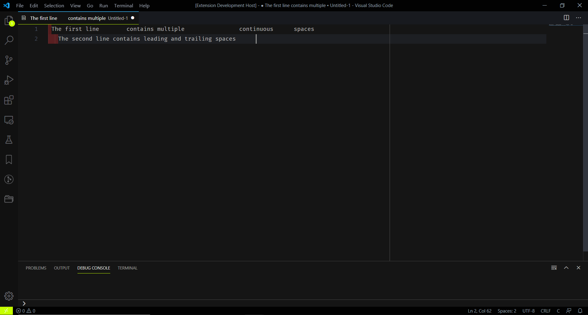
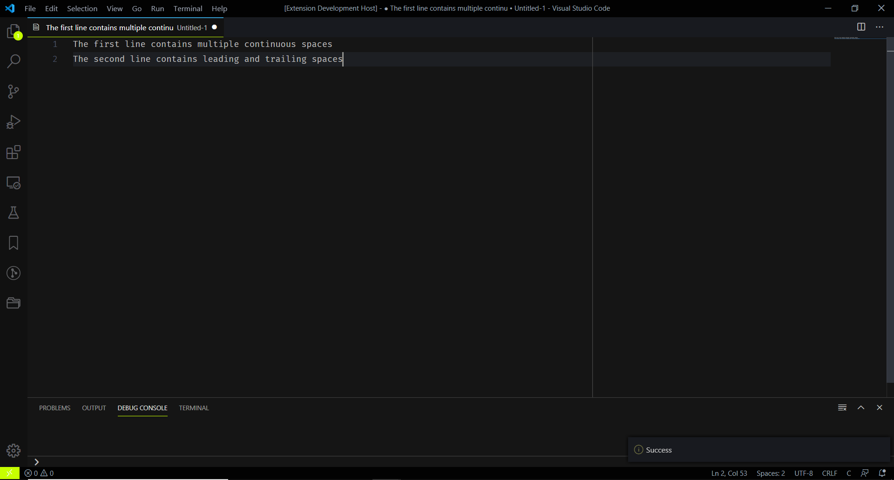

# Many To One

Convert continuous multiple spaces into a single space

## Example
Let's say you have the below text

This extension helps to remove multiple continuous spaces and convert it to single space. Also, removes unwanted leading and trailing spaces.

## Run Extension
* Press  `CTRL + SHIFT + P` (Windows) or `CMD + SHIFT + P` (Mac & Linux)
* Type `Many To One` and press `Enter`
* Now multiple spaces will be converted to single spaces

